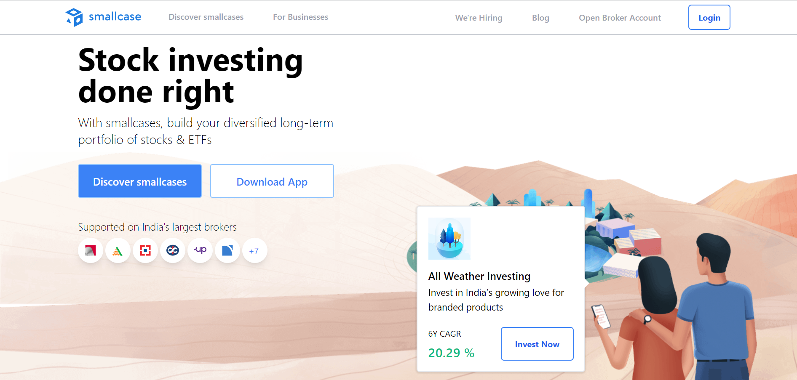
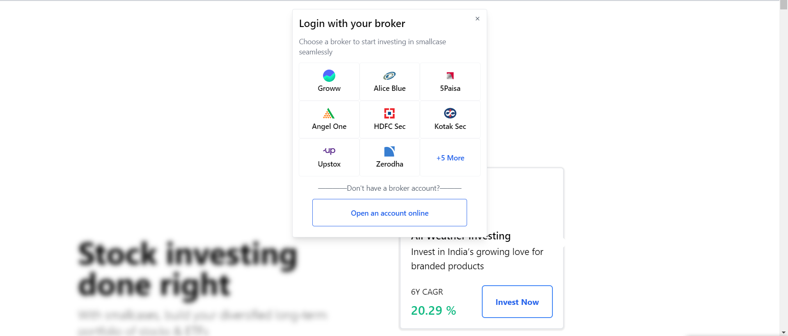
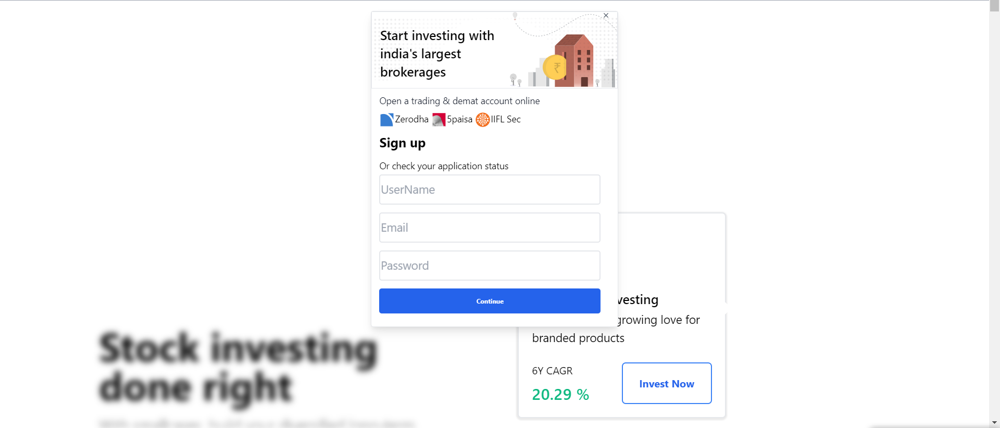
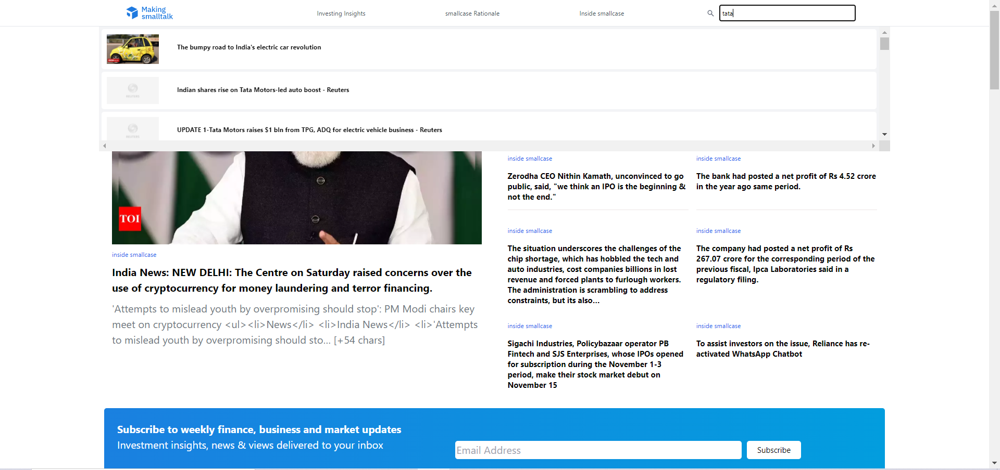
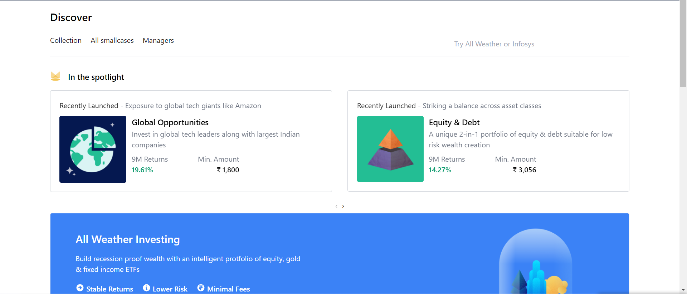
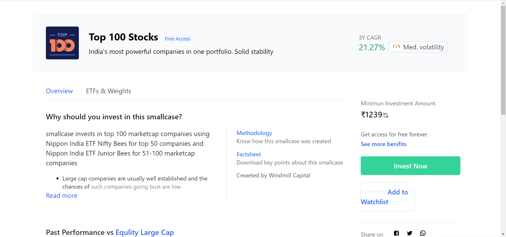
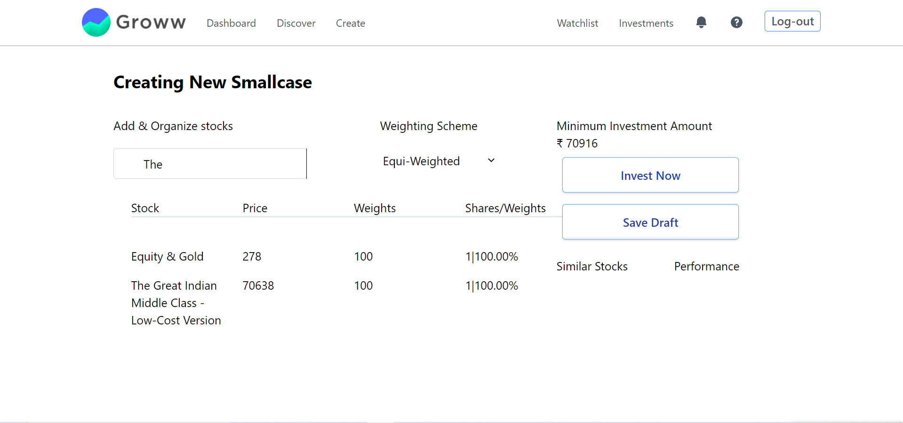

# Smallcase clone
**Note : This project is made just for educational purposes**

This project is a part of our build week in coding bootcamp name ***masai school*** so, basically as a part of build week which happens after each one month of the journey we collaborate in a team of 5-6 people and work on making a clone of a specific website .

</img>
Smallcase

## Page Details

#### Homepage

 *
When the user visits they see this page, it consists of beautiful ui components and animations.
*

 

#### Login and Signup Components

*
We have made our own fake api using a library called json-server for login and signup authentication.
*

 

 

#### BlogPage

*
As we know that news is an important part of decision making of an investor so, we have implement a beautiful- eye catching UI as well as search option for latest news with the functionality of debouncing.
*

 

 

#### Discover page

*
On the successful completion of user authentication the user will be redirected to the discover page where he/she can start exploring the world of smallcases.
*

 

#### Smallcase Information Page

*
For getting the information of a specific smallcase the user wants to select he'she can go the the information page of that particular smallcase by clicking on it or directly searching for it through the search bar and can proceed to invest in it through this page.
*

 

#### Create Page

If the user want their customised smallcases, they can create their set/group of smallcases and can invest in it

 

 <h2>Tech stack used</h2>

 <ul>
 <li style="color:blue">Tailwind css</li>
 <li style="color:blue">Raw Css</li>
 <li style="color:blue">Raw Html</li>
 <li style="color:blue">Raw Javascript</li>
 </ul>

 
Libraries used

 <ul>
 <li style="color:blue">Json-server</li>
 </ul>

<h4>Contributors</h4>

<h5>Rajesh Paul</h5>

[github](https://github.com/rajesh4210)

<h5>Shivam Pandey</h5>

[github](https://github.com/ShivCodeP)

<h5>Kamesh Hedau</h5>

[github](https://github.com/Kamesh255)

<h5>Pratham Sharma</h5>

[github](https://github.com/Spratham72)

<h5>Mohit Solanki</h5>

[github](https://github.com/mohitsolanki71)

<H3>Presentation</H3>

(https://www.youtube.com/watch?v=qErHShZl3Zg)