# Smallcase clone
**Note : This project is made just for educational purposes**

This project is a part of our build week in coding bootcamp name ***masai school*** so, basically as a part of build week which happens after each one month of the journey we collaborate in a team of 5-6 people and work on making a clone of a specific website .

</img>
Smallcase

## Page Details

#### Homepage

 *
When the user visits they see this page, it consists of beautiful ui components and animations.
*

 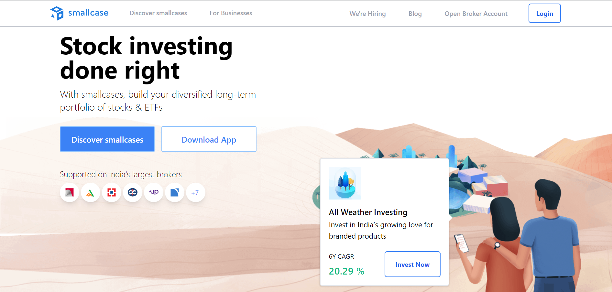

#### Signup and Login

*
We have used manual account creation as well as oauth for authentication and authorization , for user security we have used bcryptjs as well as we have implemented authorization in all the pages.
*

 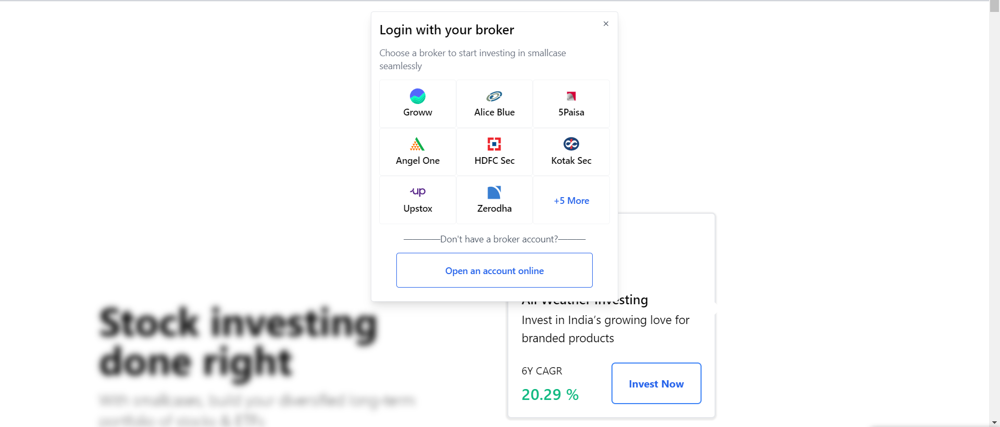
 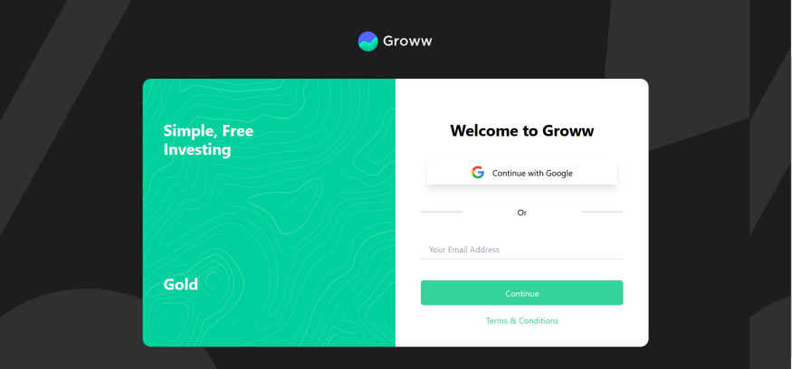

#### BlogPage

*
As we know that news is an important part of decision making of an investor so, we have implement a beautiful- eye catching UI as well as search option for latest news with the functionality of debouncing.
*

 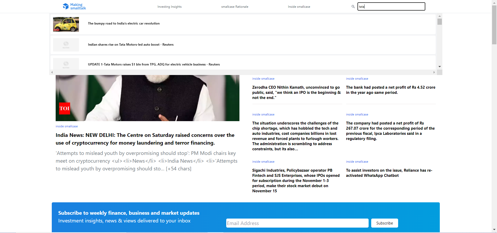

#### Discover page

*
On the successful completion of user authentication the user will be redirected to the discover page where he/she can start exploring the world of smallcases.
*

 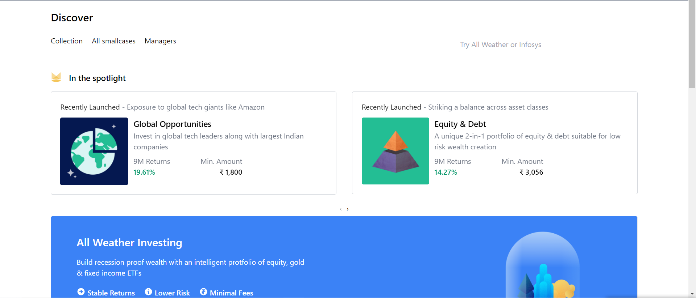

 
#### Watchlist

*
User can add smallcases into account which will be saved in database by clicking “add to watchlist” button available on product detail page and can follow it.
*

 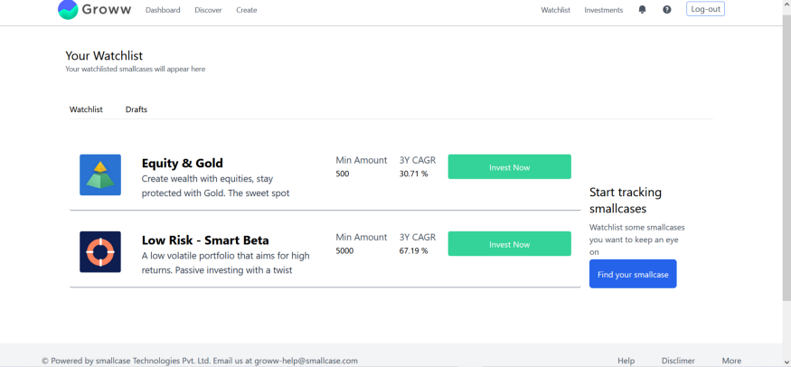

 #### All Smallcases

*
In this page user can sort or filter all the stocks and smallcases according to their need, like sorting according to price, level of risk associated with it, and investment strategy as well as can move to different pages to see all smallcases. We have implemented sorting and pagination completely from backend.
*
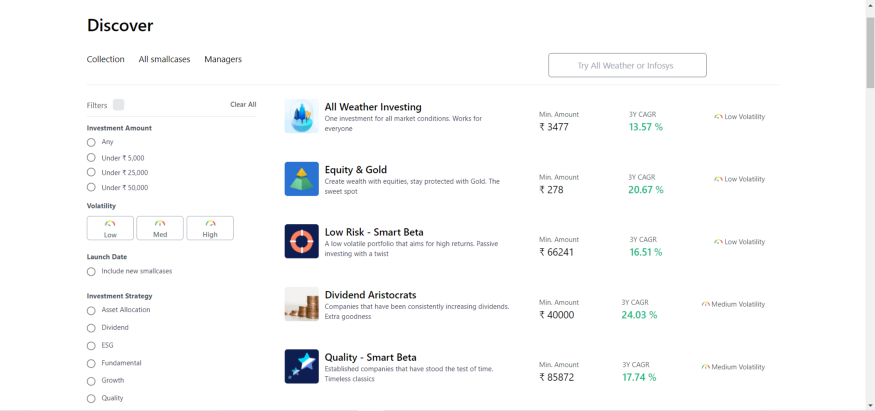

#### Smallcase Display

*
User may further click on desirable category or searched stock to land in this page and can see the details for that particular smallcase. In this page user can either add smallcases into watchlist or can proceed to payment
*

 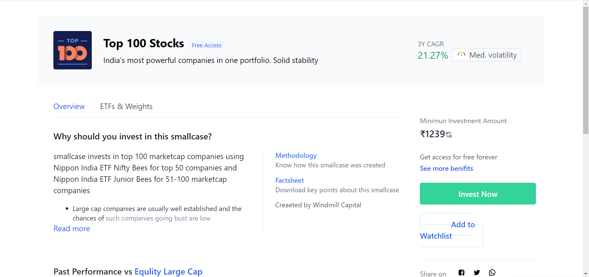

#### Payment 

*
For payment process we have integrated razorpay through which user can complete payment process on clicking payment option an OTP will be send to user mobile number and if it is valid the payment will succeed else fail.
*

 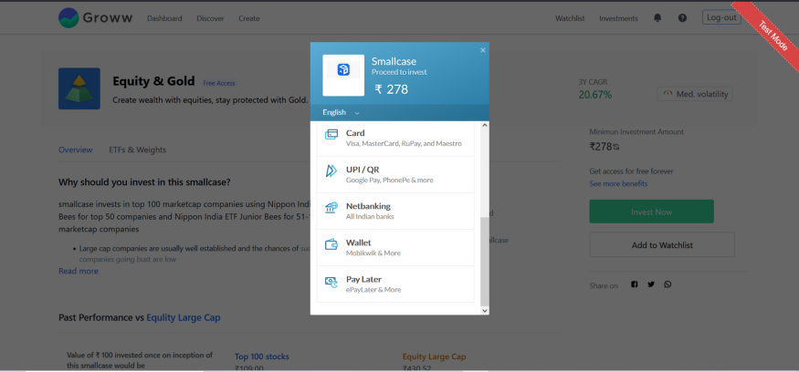

 #### Investments

*
All the smallcases which user have purchased will store here and everything will be stored in database and will remain even after the signout and can be referred from any device.
*

 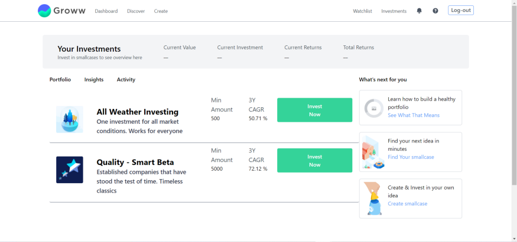

#### Create Page

If the user want their customised smallcases, they can create their set/group of smallcases and can invest in it

 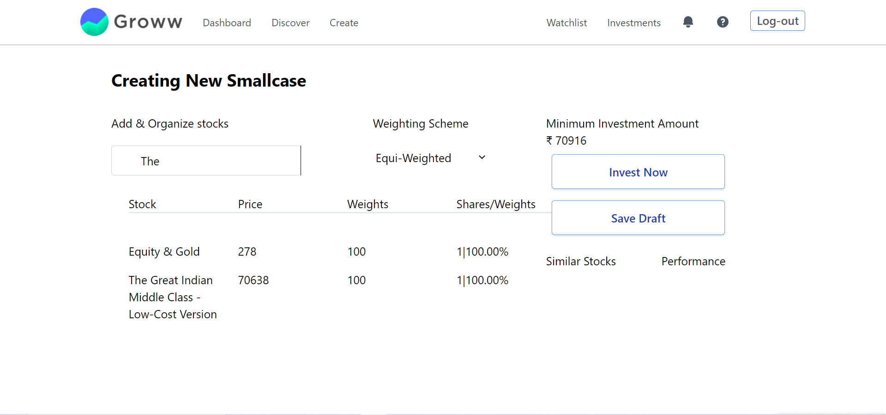

 <h2>Tech stack used</h2>

 <ul>
 <li style="color:blue">Tailwind css</li>
 <li style="color:blue">Raw Css</li>
 <li style="color:blue">Raw Html</li>
 <li style="color:blue">Raw Javascript</li>
 </ul>

 
Libraries used

 <ul>
 <li style="color:blue">axios</li>
 <li style="color:blue">bcryptjs</li>
 <li style="color:blue">dotenv</li>
 <li style="color:blue">ejs</li>
 <li style="color:blue">express</li>
 <li style="color:blue">jsonwebtoken</li>
 <li style="color:blue">messagebird</li>
 <li style="color:blue">mongoose</li>
 <li style="color:blue">node-cache</li>
 <li style="color:blue">nodemailer</li>
 <li style="color:blue">passport</li>
 <li style="color:blue">passport-google-oauth2</li>
 <li style="color:blue">razorpay</li>
 <li style="color:blue">redis</li>
 <li style="color:blue">redis-server</li>
 <li style="color:blue">tailwindcss</li>
 <li style="color:blue">uuidv4</li>

 </ul>

<h4>Contributors</h4>

<h5>Rajesh Paul</h5>

[github](https://github.com/rajesh4210)

<h5>Shivam Pandey</h5>

[github](https://github.com/ShivCodeP)

<h5>Kamesh Hedau</h5>

[github](https://github.com/Kamesh255)

<h5>Pratham Sharma</h5>

[github](https://github.com/Spratham72)

<h5>Mohit Solanki</h5>

[github](https://github.com/mohitsolanki71)

<H3>Presentation</H3>

(https://www.youtube.com/watch?v=qErHShZl3Zg)